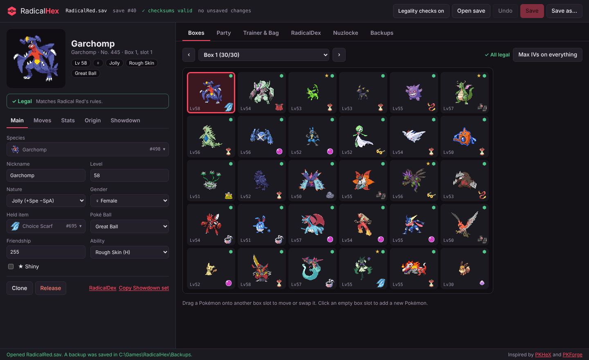
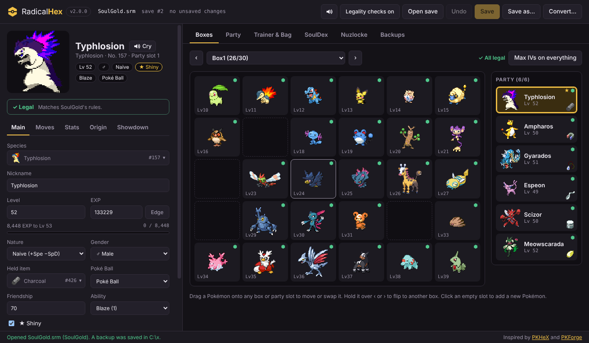
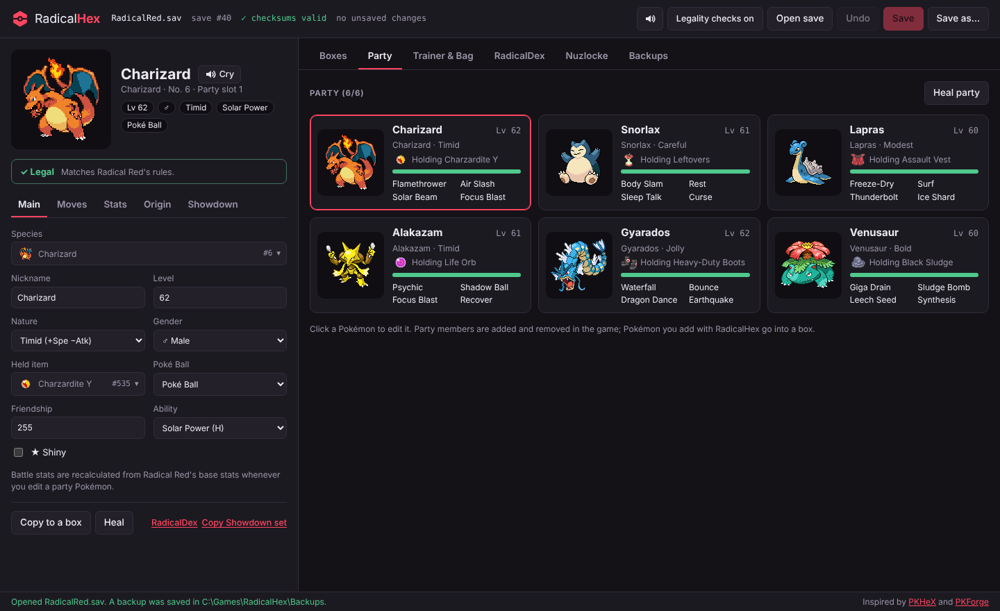
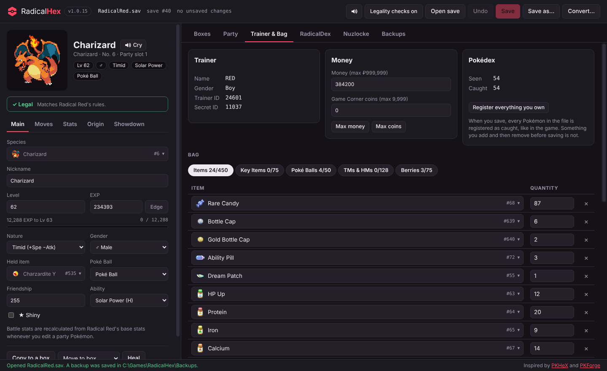
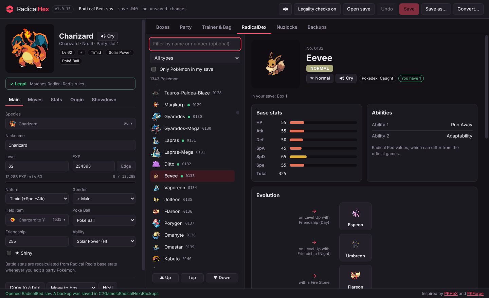
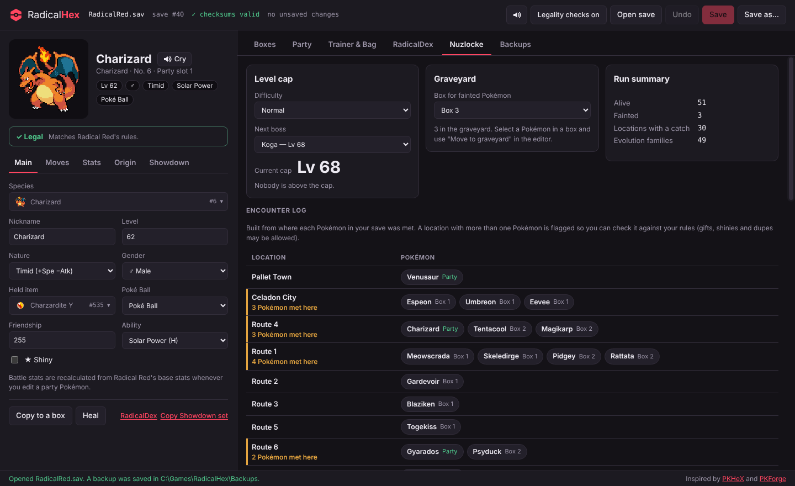

<p align="center"></p>

<h1 align="center">RadicalHex — Radical Red & SoulGold Save Editor</h1>

<p align="center">A free <b>Pokémon Radical Red 4.1</b> and <b>Pokémon SoulGold</b> save editor and Pokédex for Windows, in the spirit of PKHeX.<br>Edit Pokémon, boxes, party, items and money in your <code>.sav</code> or <code>.srm</code> file, check legality, and plan Nuzlocke runs.</p>

<p align="center">Tested and used alongside <b>mGBA</b> and <b>RetroArch</b> (the Steam version on PC, and Android), and works with saves from both.</p>

<p align="center"><a href="https://github.com/jajaa17/RadicalHex/releases/latest"><b>Download RadicalHex.exe</b></a> · <a href="https://github.com/jajaa17/RadicalHex/issues/new/choose">Report a problem</a></p>



> [!WARNING]
> **Editing a save always carries some risk. Use RadicalHex at your own risk.**
> RadicalHex backs up your save every time you open or save it, checks every save before writing it, and refuses to write anything that looks wrong. Even so, it can't guarantee your save will never break. Radical Red and SoulGold are ROM hacks with their own rules, and some edits the file allows can still confuse the game: RadicalHaX mode, battle-only forms, key items, story items, extreme values, or lots of big edits at once. **Keep your own copy of your save before editing**, make changes a few at a time, and test them in the game. If something goes wrong, restore a backup from the **Backups** tab.

## Download

Download **RadicalHex.exe** from the [Releases page](https://github.com/jajaa17/RadicalHex/releases) and run it. There is nothing to install.

**Put RadicalHex.exe in its own folder** (for example `C:\Games\RadicalHex`) before running it. RadicalHex makes a **`Backups`** folder next to the .exe and keeps a copy of your save there every time you open or save. If you move the .exe, move the `Backups` folder with it. If that folder can't be written to (such as inside Program Files), backups go to `Documents\RadicalHex\Backups` instead.

The app is not code-signed, so Windows SmartScreen may say "Windows protected your PC". Click **More info → Run anyway**.

Every release also includes the full source code (zip and tar.gz), so anyone can check it or build it themselves. See [Building from source](#building-from-source).

**Found a bug or something wrong?** Please report it on the [Issues page](https://github.com/jajaa17/RadicalHex/issues/new/choose). Every report helps.

## Features

### Two games: Radical Red and SoulGold
RadicalHex opens saves from **Pokémon Radical Red 4.1** and **[Pokémon SoulGold](https://github.com/Eemeliri/soulgold)** (the Johto hack by Eemeliri, built on pokeemerald-expansion). It works out which game a save is from by itself.
- **Each game keeps to itself.** Radical Red and SoulGold store their saves completely differently, so each has its own save engine, Pokémon, moves, items, abilities, learnsets and locations. A SoulGold save only ever offers SoulGold species, moves and items, and a Radical Red save only Radical Red's, so nothing crosses over.
- **You can see which game is open:** a SoulGold save turns the accent from crimson to gold, the status line says "(SoulGold)", and the Pokédex tab becomes the **SoulDex**.
- **The same features for both:** boxes with drag and drop, party, the editor (species, level, EXP, nature, shininess, ability, moves, IVs, EVs, held item, ball, origin), legality checks, Showdown sets, trainer and bag, Pokédex registration, Nuzlocke tools, backups, the save converter and undo.
- **SoulGold's Mega Stones:** SoulGold shares Mega Stones by type (Watertite, Dragotite and so on, plus the Bondstone). With legality checks on, the bag and held-item lists only offer those, and a Pokémon holding one of the leftover official stones (which do nothing in SoulGold) gets a warning. RadicalHaX mode lists every stone.
- **SoulGold specifics:** 19 PC boxes, 8 bag pockets (including Medicine, Mega Stones and Battle Items), 12-letter nicknames, innate abilities shown in the SoulDex, and the new Mega Evolutions (Typhlosion, Meowscarada, Primarina, Absol-Z and more) as battle-only forms.
- **Candy Jar, casino and BP:** the Trainer & Bag tab edits the **Candy Jar**'s stored EXP (it turns into Exp. Candies when you use the jar), the **Game Corner coins** every casino game uses (slots, blackjack, gacha, the derby and the rest), and your **Battle Points** for the BP shop. You can set these before you reach them in the story; the game simply uses them once you get there.
- **SoulGold's data comes straight from the game.** Its species, base stats, learnsets, evolutions, items, moves and sprites are read from the hack's own source with the same compiler the game is built with, and the save layout was checked byte for byte against real SoulGold saves.
- **Checked with SoulGold's own save code.** SoulGold's real save routines (compiled for the GBA's CPU and run in an emulator) load every save RadicalHex writes, exactly as RadicalHex wrote it, including all 19 boxes, the party and the bag, and then save over it again with every edit kept.



### Boxes
- All 25 boxes (23–25 unlock in the game as your PC fills up) with normal and shiny sprites, a star for shinies, a mark for perfect IVs and the icon of each held item
- Add a new Pokémon to any empty slot: species, level, nature, gender, shiny, held item, Poké Ball, friendship, ability, moves, IVs and EVs
- Paste a Pokémon Showdown set to fill in a new Pokémon, or copy any Pokémon as a Showdown set
- **Drag and drop like PKHeX:** your party is shown next to the box. Drag any Pokémon onto any box or party slot to move it there, or onto another Pokémon to swap them. Hold a Pokémon over ‹ or › to flip to another box. Clone and release from the editor
- **Move to box** sends a Pokémon to the first free slot of any other box, and **Move to party** puts it at the end of your party
- Max IVs on every Pokémon in one click
- **Box names and wallpapers**: rename any box (up to 8 letters, like the game) and pick its wallpaper from the PC's own wallpaper menu. In SoulGold you can also unlock Walda's hidden **Friends** wallpaper (Radical Red has no hidden wallpapers: all 16 are already in its menu)

### Party


- Your six party Pokémon as cards with sprite, level, nature, held item, HP, status and moves. Status shows as the game's short tag (PSN, TOX, BRN, PAR, SLP, FRZ, FNT), on the party cards and next to your party in the Boxes tab; hover it for the full name
- **Heal**: restore HP (fainted Pokémon included), cure poison, burn, sleep, freeze and paralysis, and refill PP, for one Pokémon or the whole party
- **Add a Pokémon straight to your party**: click an empty party slot
- Drag party cards onto each other to change the order. **Move to box** (or dragging in the Boxes tab) puts a party Pokémon in a box, and the rest of the party moves up, like in the game. Your last Pokémon has to stay (eggs don't count)
- Edit them like any other Pokémon, or copy them into a box. Their battle stats update automatically when you change level, nature, IVs or EVs

### Editing a Pokémon
- Species, nickname, level, exact EXP, nature, gender, shininess, held item, Poké Ball, friendship, ability, all four moves (including Radical Red's Gen 9 moves), IVs and EVs
- **EXP** like PKHeX: type an exact EXP and the level follows it. The editor shows the EXP range of the current level and how much is left to the next one, and **Edge** sets it 1 EXP before the next level. An EXP bar like the game's summary screen shows how far into the level it is
- **Ability** is a dropdown like PKHeX's, listing the species' own abilities by name: ability 1, ability 2 (if it has one) and its hidden ability (H). Changing it keeps the nature, shininess and gender, like the game does when it changes an ability
- **Origin** (like PKHeX): original trainer name, gender, trainer ID and secret ID, met location and met level, plus **Make it mine** to give it your trainer details. Changing the IDs keeps it shiny or not shiny. The met location list puts the places where that Pokémon's evolution family is found in Radical Red first. With legality checks on, the met level can't go above its level and the OT needs a name. RadicalHaX mode allows any location number and met level
- **Moves** list only what the species can learn in Radical Red (level-up, TM, tutor, egg and pre-evolution moves), and not moves it already knows. Moves it learns by levelling up later show their level, e.g. "Bounce · Lv 39". In RadicalHaX mode every move is listed
- **EVs** stop at the game's limits: 252 per stat and 510 in total. The arrows stop there, and a bigger number you type is lowered to what is left. RadicalHaX mode allows up to 255 with no total
- **Ctrl+click shortcuts** (like PKHeX): Ctrl+click Level, Friendship, an IV, an EV, an item quantity, money, coins, Battle Points or the Candy Jar to max it (EVs stop at what the 252/510 limits leave). With a Pokémon selected, Ctrl+click an empty box slot or party slot to drop a copy of it there
- **PP and PP Ups** for every move, like PKHeX: set each move's PP and how many PP Ups it has had (0-3). Raising PP Ups raises full PP like the item does in the game; **Max PP Ups** uses 3 on every move and **Restore PP** refills them. Radical Red box Pokémon get full PP when taken out, so only their PP Ups are kept; SoulGold box Pokémon keep their PP too
- **Evolve and Devolve** buttons under Species: one click for a single next stage (Charmander → Charmeleon), or a picker with each choice's sprite and evolution method for branching Pokémon (Eevee, Rockruff, Tyrogue...). Level, nature, IVs, EVs, moves and a custom nickname are kept
- **Species list filtered by type**, with each Pokémon's types shown next to it
- **Move types and categories**: every move list, move slot and party card shows the move's type and whether it is Physical, Special or Status. Move lists can be filtered by type (only the types that Pokémon can learn, with how many of each) and by Physical, Special or Status
- **Minimal Grinding mode** is detected. In a Minimal Grinding save the game keeps every IV at 31 and gives no EVs, so RadicalHex locks IVs at 31 and EVs at 0 (in the editor, the Add form and Showdown imports), shows the mode on the Trainer tab, and warns about any Pokémon that doesn't match, with a one-click fix. RadicalHaX mode unlocks them
- Items show Radical Red's own bag icons everywhere: held items, the bag and every item list
- Every list (species, items, moves, bag) opens as a list you can browse by scrolling, by clicking a letter (A–Z), or with Page up and Page down buttons. Typing to filter is optional, and nothing needs a scroll wheel.

### Legality check and RadicalHaX mode
- Like PKHeX's legality check: every Pokémon is checked against Radical Red 4.1's own data, and the editor shows **✓ Legal**, warnings or **✕ Illegal** with the reason
- Catches moves the species can't learn in Radical Red (level-up, TM, tutor, egg and pre-evolution moves are all counted), and warns about a move it only learns by levelling up at a higher level than it is (like PKHeX's "learned at level 39"; a warning rather than an error, since Radical Red's Move Relearner may teach some early), duplicate moves, battle-only forms such as Megas outside battle, EVs above 252 or 510 in total, a hidden ability on a species without one, impossible met levels, key items as held items, and party stats that don't match
- The Boxes tab counts the illegal Pokémon in your save. Click the count to jump from one to the next
- **RadicalHaX mode** (the button in the top bar) is the PKHaX-style mode: legality checks are off and anything goes, including Megas and other battle-only forms. The save safety checks below always stay on, so the file itself can't be damaged

### Trainer & Bag


- Money and Game Corner coins
- The whole bag: Items, Key Items, Poké Balls, TMs & HMs and Berries, with "add every TM/HM, ball or berry"
- Pokédex counts, and one click to register every Pokémon you own
- **Pokédex like PKHeX:** when you save, every Pokémon in the file is marked as seen and caught, as the game does for anything you own. If you add a Pokémon by mistake and remove or replace it before saving, it isn't registered

### RadicalDex


A Pokédex built from Radical Red's own data, so it matches the hack rather than the official games:
- Every species and form, with sprites, filter by name, number, type, **generation** (by National Dex number) and **location** (every route and area in story order), and "only Pokémon in my save". Click a place in a Pokémon's location table to list everything found there. The SoulDex has the same filters with SoulGold's own routes
- Types, base stats and abilities (ability 1, ability 2 and hidden ability) as they are in Radical Red, each with **what it does** (the game's own description; the SoulDex uses SoulGold's longer ones, for innates too)
- **Where to find it:** every location, method (grass by day or night, surfing, fishing rods, Rock Smash, gifts, trades, overworld, roaming, raids), levels and encounter chance
- **Evolution tree** with Radical Red's evolution methods
- **Mega Evolutions and form changes**, such as Primal Groudon with the Red Orb
- **Other forms**, such as Alolan, Galarian, Hisuian, Paldean and Sevii forms
- Level-up moves
- Shows how many of each Pokémon you have, where they are, and your Pokédex status. It also works without opening a save.

### Nuzlocke tools


- **Level caps** from the official Radical Red 4.1 docs for Normal and Hardcore, and a list of Pokémon above your current cap
- **Graveyard box**: pick a box for fainted Pokémon and move them there from the editor, from a box or straight from your party
- **Encounter log** built from where each of your Pokémon was met, with locations that have more than one catch flagged
- **No encounter yet**: locations with wild Pokémon where you have no catch so far
- **Missed encounters**: fainted, ran from or failed to catch your first encounter somewhere? Record it (location, the Pokémon from that area's encounter list, and what happened) and the location counts as used: it leaves "No encounter yet", shows in the encounter log, and a catch there afterwards is flagged. Click a location under "No encounter yet" to fill the form
- **Evolution families you own**, for the dupes clause
- Settings are remembered per trainer

### Safety
- A backup is saved to the `Backups` folder next to RadicalHex.exe every time you open a save and right before every save. Backups keep your save's own file type (a `.srm` is backed up as `.srm`, a `.sav` as `.sav`). Restore any of them from the **Backups** tab; a backup of the other layout (mGBA `.sav` with clock data, RetroArch `.srm` without) is fitted to the open file, so it keeps the size its emulator expects. To keep the folder tidy, tick backups and delete them, or use **Select all but the newest 5** (per save). The tab also lists backups made by versions before 1.0.5 (those were kept in `Documents\RadicalHex\Backups`).
- Every save is checked before it is written. RadicalHex rebuilds the file, reloads it, makes sure only the parts it is allowed to edit changed, and validates every Pokémon and bag entry you touched. If anything is off, nothing is written.
- Files are written to a temporary file first, verified, then swapped in.
- Only the newest save slot is edited, so the game's previous save stays as a fallback. RadicalHex picks that slot the same way the game does, so a half-written save (from copying the file while the game was saving) is never mistaken for the real one.
- Undo (Ctrl+Z) for every edit, and a warning before closing with unsaved changes.
- The Open dialog starts in the folder of the last save you opened.

### Save converter (RetroArch .srm ↔ .sav)
Play on your phone with RetroArch, then carry on on your PC (or the other way around). RadicalHex has been tested and used alongside mGBA and RetroArch (Steam on PC, and Android).
- **Convert…** in the top bar makes a copy of your save for another emulator:
  - **RetroArch (.srm)** for RetroArch on Android or PC, with the mGBA or VBA-M core
  - **Other emulators (.sav)** for mGBA, VBA-M, My Boy!, Pizza Boy and others. This also turns a RetroArch `.srm` back into a `.sav`
- Only the file's layout changes. mGBA adds 16 bytes of clock data after the 128 KB of game data, and RetroArch doesn't use them. Your Pokémon, bag, Pokédex and progress are copied byte for byte.
- Failsafes:
  - The save you have open is never changed, and the copy can't be written over it.
  - The copy is checked before it is written. RadicalHex loads it as a save and compares it with the original, so a damaged or non-Radical Red file isn't converted.
  - Like a normal save, it is written to a temporary file first, then verified and swapped in.
  - If a file with that name is already there, it is backed up to `Backups` first.
  - With unsaved changes, RadicalHex asks whether to save first. The copy is made from the file on disk.

- Every Pokémon has a **Cry** button (in the editor and the RadicalDex). Clicking its big sprite plays the cry too, and it hops along
- Little GBA-style sounds for clicks, tabs, picking from lists, saving, undo, errors, adding a Pokémon (a Poké Ball catch), releasing, healing and making a Pokémon shiny
- The speaker button in the top bar turns the sounds off or on. Cries still play when you ask for one
- Light: the sounds are made by the app as they play (no sound files), and each cry is a small file that only loads when you press Cry

### Updates
- The version you have is shown next to the RadicalHex name at the top left.
- When RadicalHex starts, it checks GitHub for a newer version. If there is one, the version turns red. Click it, then **Update now**.
- RadicalHex downloads the new `RadicalHex.exe` next to yours and keeps it only if it matches the checksum GitHub publishes for that file. Then it closes, and the new version replaces the old `RadicalHex.exe` and starts. Your saves and the `Backups` folder aren't touched.
- If anything goes wrong (no internet, a bad download, the folder can't be written to, the old .exe is still in use), your current `RadicalHex.exe` stays exactly as it was, and RadicalHex tells you what happened.
- Don't want it to go online? Click the version and untick **Check for updates when RadicalHex starts**. You can still check by hand with **Check now**, or download new versions from the [Releases page](https://github.com/jajaa17/RadicalHex/releases).
- Updating in place starts with v1.0.9. If you have an older version, download v1.0.9 or newer once by hand.

### Fits your screen, light on memory
- Works on anything from old 1024×768 monitors and scaled laptop screens to large displays. The layout adapts when the window is small or not maximized.
- Only the tab you are looking at is kept in memory, and long lists only draw the rows on screen, so RadicalHex stays light even on older PCs.
- A small splash shows while the portable .exe unpacks, then a loading screen while the Pokémon data loads, so you never stare at a blank window when it starts.

## Using it

1. **Close the game in your emulator** (or at least do not save in-game) before editing, or the emulator may overwrite your changes.
2. Open your battery save (`.sav` / `.srm`), not a save state.
3. Edit, then press **Save** (Ctrl+S). Use **Save as…** to write a copy instead, or **Convert…** to make a copy for RetroArch (`.srm`) or other emulators (`.sav`).
4. Load the save in your emulator.

Good to know:
- New Pokémon can go into a box or straight into your party. A Pokémon moved into the party gets full HP and PP, the same as withdrawing it in the game.
- Party Pokémon store their battle stats separately. RadicalHex recalculates them for you when you edit a party Pokémon, and the Stats tab has a **Recalculate stats** button.
- Like the main games, a Pokémon in Radical Red has ability 1, ability 2 or its hidden ability, and RadicalHex lets you pick any of the ones its species has.

## FAQ

**Is there a PKHeX for Radical Red?**
PKHeX can't edit Radical Red saves properly, because Radical Red is built on the Complete Fire Red Upgrade engine and stores Pokémon, boxes and the Pokédex its own way. RadicalHex is a PKHeX-style save editor made for Radical Red's format.

**How do I edit my Radical Red or SoulGold save?**
Close the game, download `RadicalHex.exe` from the [Releases page](https://github.com/jajaa17/RadicalHex/releases/latest), open your `.sav` (or `.srm`), make your changes and press **Save**. Then load the game again. See [Using it](#using-it).

**Which saves does it open?**
Radical Red 4.1 and SoulGold battery saves (`.sav`, `.srm`) from emulators like mGBA, VBA-M, RetroArch and My Boy!. RadicalHex tells which game a save is from by itself. Not save states. If your emulator is on a phone, copy the save to a PC, edit it there and copy it back.

**How do I play the same save on my phone (RetroArch) and my PC?**
1. On the PC, open your save in RadicalHex and press **Convert…** → **RetroArch (.srm)**.
2. Give the `.srm` the same name as your ROM. For example, if the ROM is `Pokemon Radical Red.gba`, the save must be `Pokemon Radical Red.srm`.
3. Copy it to your phone, for example through Google Drive, into RetroArch's saves folder. That is often `RetroArch/saves` (or a folder inside it named after the core, such as `saves/mGBA`), but check **Settings → Directory → Save Files** in RetroArch.
4. Close RetroArch's game before copying the save over, then load the ROM. Use in-game saves, not save states.
5. To go back to the PC:
   - **RetroArch on the PC too** (for example the Steam version): no converting needed. Copy the `.srm` as it is into the PC's RetroArch saves folder, such as `steamapps\common\RetroArch\saves\mGBA`.
   - **mGBA or another emulator on the PC:** open the `.srm` in RadicalHex, press **Convert…** → **Other emulators (.sav)**, and save it with your ROM's name next to that emulator's saves.

**Before you copy a save off the phone (or the PC), close the game in RetroArch** (**Close Content**, or quit RetroArch) a few seconds after saving in-game. Once the game is closed, RetroArch has written the whole `.srm`. A copy made earlier can catch the game halfway through saving.

Keep a copy of your save before swapping files around. RadicalHex keeps one in `Backups` every time you open a file.

**The game says my save file is corrupted, or RadicalHex says the newest save is incomplete**
The game keeps two copies of your save and writes over the older one each time you save. If the file was copied while the game was still saving (for example straight after saving in RetroArch, before closing the game), the newest copy is cut short. The game then says the save file is corrupted and loads the previous complete save. Your next in-game save replaces the broken copy. RadicalHex does the same: it opens the previous complete save, tells you, and never touches the broken copy.

**Box 21 or 22 was full of "?" Pokémon**
Parts of a save the game has never written read as blank (`0xFF`) bytes, and a fresh RetroArch `.srm` starts that way. RadicalHex 1.0.16 and newer show those slots as empty. When you save, it turns them into normal empty slots.

**Which version of Radical Red?**
Radical Red **4.1**. It is built from 4.1's own data and tested on real 4.1 saves.

**Which version of SoulGold?**
The SoulGold that saves its PC in the current layout (19 boxes, the "BX19" format), which is what new SoulGold games use. RadicalHex is built from SoulGold's source as of October 2026. If you open an older SoulGold save, RadicalHex asks you to load it in the game and save once, which updates it to the current layout. If a newer SoulGold adds things RadicalHex doesn't know, it warns you before you edit, just like for Radical Red.

**Is SoulGold the DS game?**
No. This is the SoulGold **ROM hack for the GBA** by Eemeliri ([GitHub](https://github.com/Eemeliri/soulgold), [HackDex](https://www.hackdex.app/hack/soulgold)), a Johto adventure built on pokeemerald-expansion. Saves from the Nintendo DS games HeartGold and SoulSilver are a different format and won't open.

**What about Radical Red 5.0?**
When a new version of Radical Red comes out, RadicalHex will need an update for its new Pokémon, moves, items and any save changes. Until then, if you open a save that has Pokémon, moves or items Radical Red 4.1 doesn't have, RadicalHex warns you before you edit it, so a newer save isn't damaged by accident. Updates reach you through the app's own updater.

**Does it work on Mac, Linux or Android?**
The download is for Windows. On other computers you can run it from source (see [Building from source](#building-from-source)).

**Is it safe?**
It backs up your save every time and checks every save before writing it, but editing a save always carries some risk. Read the warning at the top first.

## Reporting a problem

If you find any issue, please report it on the [Issues page](https://github.com/jajaa17/RadicalHex/issues/new/choose) and pick **Bug report**, **Save problem**, **Wrong game data** or **Feature request**. Each form asks **which game the save is from (Radical Red or SoulGold)**. Please pick the right one, because the two games work completely differently. Your original save is always in the `Backups` folder next to RadicalHex.exe, so attaching it is safe.

## What it's built with

- **[Electron](https://www.electronjs.org/)**, the same base used by apps like Discord and VS Code. Electron is an open-source project of the OpenJS Foundation (it was started by GitHub). It packs two things into one Windows app:
  - **Chromium**, the open-source browser engine behind Google Chrome, which draws the window
  - **Node.js**, which handles your files: opening and saving saves, and making backups
- The app itself is plain **HTML, CSS and JavaScript**, with no frameworks or extra libraries. All the save reading, editing and checking is in `src/core.js` (Radical Red) and `src/sg-core.js` (SoulGold).
- **[electron-builder](https://www.electron.build/)** turns it into the single `RadicalHex.exe`, and **GitHub Actions** builds it on Windows from this code for every release, so the .exe isn't built on anyone's own PC.
- The data and asset tools in `tools/` use **Node.js**, **Python** (with Pillow for the item icons) and **ffmpeg** (for the cries).
- The sounds are made by the app as they play, with the browser's Web Audio feature, so there are no sound files for them.

**Why is the .exe about 100 MB?** Almost all of it is Electron, because every Electron app brings its own copy of Chromium. RadicalHex's own code, data, sprites, item icons and cries are about 20 MB of that. The download is already trimmed (English-only browser files, maximum compression).

**Does it go online?** Only to check for updates: when it starts, it asks GitHub for the latest RadicalHex release. Nothing about you or your saves is sent, and you can turn the check off (see [Updates](#updates)). Everything else stays on your PC.

## Building from source

Requires Node.js 22.

```sh
npm ci
npm start          # run the app
npm run check      # data and safety checks
npm test -- path/to/your.sav [more.sav]   # full edit and round-trip tests against real Radical Red saves
npm run test:sg -- path/to/soulgold.srm   # the same for SoulGold saves
npm run dist       # build dist/RadicalHex.exe
```

Every push to `main` makes GitHub Actions build `RadicalHex.exe` on Windows and publish it as the release for the version in `package.json`.

The data files are generated, in this order, from the sources listed below:

```sh
node tools/build-dex.js <sources>        # src/dex.js and tools/rr-tables.json
python3 tools/build-data.py <sources>    # src/data.js and the sprites
python3 tools/build-items.py <sources>   # the item icons
python3 tools/build-cries.py <sources>   # the cries (needs ffmpeg)
```

The top of each script lists which repositories go in the `<sources>` folder.

SoulGold's data, sprites and item icons come from one script that compiles SoulGold's own data tables with the ARM compiler the game is built with ([arm-none-eabi-gcc](https://github.com/xpack-dev-tools/arm-none-eabi-gcc-xpack)) and reads the numbers back, so they match the game exactly:

```sh
python3 tools/build-sg-data.py <soulgold repo> <path to arm-none-eabi-gcc>   # src/sg-data.js, src/sg-dex.js, src/assets/sg
```

To check SoulGold saves with the game's own save code (needs `pip install unicorn`):

```sh
tools/sg-gamecheck/build.sh <soulgold repo> <arm-none-eabi bin folder>
python3 tools/sg-gamecheck/gamecheck.py [--resave] edited.srm
```

The screenshots in `docs` are made from a demo save with `npx electron tools/screenshots.js`.

## Credits

- [PKHeX](https://github.com/kwsch/PKHeX) by Kaphotics and contributors, the save editor RadicalHex is modeled after
- [PKForge](https://github.com/sofianeelhor/PKForge) by sofianeelhor, whose Radical Red engine documents the save layout RadicalHex follows, and whose Radical Red 4.1 species and item tables come from [Rad-Red-4.1-Team-Exporter](https://github.com/eliyahu1702/Rad-Red-4.1-Team-Exporter)
- The official [Radical Red Pokédex](https://dex.radicalred.net) ([source](https://github.com/JwowSquared/Radical-Red-Pokedex)) for species data, abilities, evolutions, locations, moves, items, item icons and level caps
- [pret/pokefirered](https://github.com/pret/pokefirered) for FireRed's location names
- [Complete Fire Red Upgrade](https://github.com/Skeli789/Complete-Fire-Red-Upgrade), the engine Radical Red is built on
- Radical Red's own `Base_Stats.c` (from the history of [Ydarissep/Radical-Red-Pokedex](https://github.com/Ydarissep/Radical-Red-Pokedex)) for experience growth rates
- [PokéAPI](https://github.com/PokeAPI/pokeapi) for national Pokédex numbers and gender ratios, [PokéAPI sprites](https://github.com/PokeAPI/sprites) for the Pokémon sprites, and [PokéAPI cries](https://github.com/PokeAPI/cries) for the cries
- [SoulGold](https://github.com/Eemeliri/soulgold) by Eemeliri ([HackDex](https://www.hackdex.app/hack/soulgold)), whose source and docs RadicalHex's SoulGold data, sprites, item icons, locations and save layout come from, built on [pokeemerald-expansion](https://github.com/rh-hideout/pokeemerald-expansion) by the RHH team and on the [Pokémon HnS](https://github.com/PokemonHnS-Development/pokemonHnS) team's work (see SoulGold's own credits for everyone involved)
- [RetroArch](https://www.retroarch.com/) by the libretro team and [mGBA](https://mgba.io/) by endrift, whose save formats the save converter works with
- Pokémon Radical Red by soupercell and the Radical Red team, and Pokémon SoulGold by Eemeliri

RadicalHex is a fan project and is not affiliated with Nintendo, Creatures Inc., GAME FREAK inc. or The Pokémon Company. Pokémon names, sprites and cries are © their respective owners. Please do not use edited Pokémon against people who have not agreed to it.

### A note from me

RadicalHex started as something just for my own Radical Red saves. I decided to put it on GitHub for anyone else who wants to use it. It's free and open source, so if you don't trust a random .exe (fair!), you can read every line of the code here, or build it yourself from source.

I'm new to JavaScript and the other languages RadicalHex is written in. I wanted a save editor for Radical Red, so I built this with help from [Claude](https://claude.ai) by Anthropic, which showed me how to do things I didn't know were possible yet.

## License

GPL-3.0-or-later, matching PKHeX and PKForge. See [LICENSE](LICENSE).
